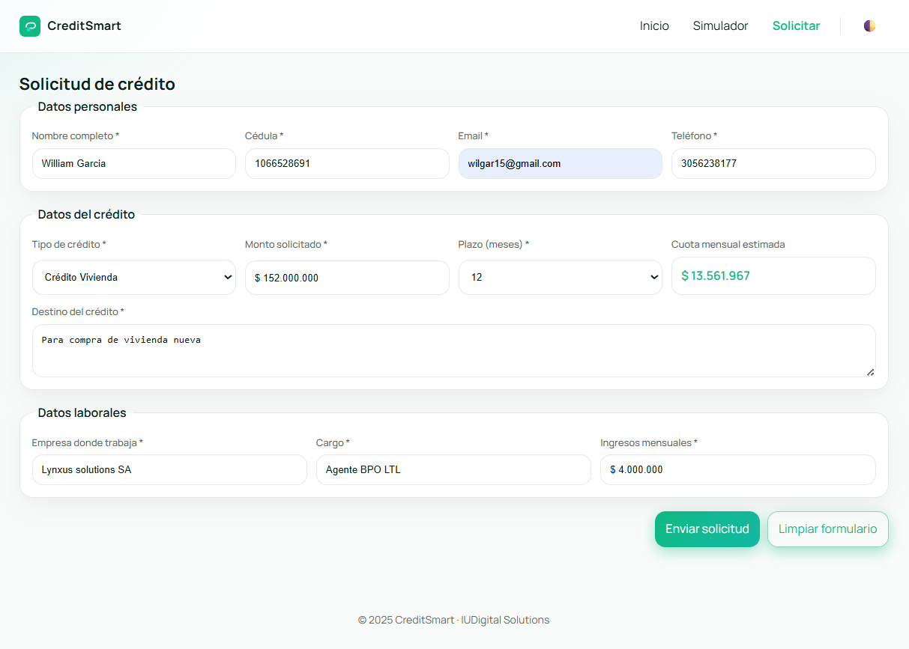

# 🎓 CreditSmart

**Estudiantes:** William Garcia Leonel y José David Osorio Gallego

---

## 📋 Descripción del Proyecto

**CreditSmart** es una aplicación web dinámica desarrollada con **React 18** que permite a los usuarios explorar, comparar, simular y solicitar diferentes tipos de créditos financieros de manera intuitiva y eficiente.

Es una transformación de una aplicación estática HTML/CSS/JS original a una **Single Page Application (SPA)** completamente interactiva con navegación fluida, formularios validados en tiempo real, cálculos financieros automáticos, y una **integración completa con Firebase/Firestore** para persistencia de datos en la nube.

---

## 🚀 Tecnologías Utilizadas

### Frontend
- **React 18** - Librería principal para construcción de interfaces
- **Vite** - Herramienta de construcción rápida (más moderna que Create React App)
- **React Router DOM v6** - Manejo de navegación entre páginas

### Backend y Base de Datos
- **Firebase/Firestore** - Base de datos NoSQL en la nube para persistencia de datos
- **Firebase Hosting** - Despliegue en producción (opcional)

### Características Técnicas
- ✅ Componentes funcionales con hooks (useState, useEffect, useLocation, useSearchParams)
- ✅ Estado reactivo y manejo avanzado de datos
- ✅ Formularios 100% controlados con validaciones progresivas
- ✅ Búsqueda y filtros dinámicos con lógica de superposición
- ✅ Cálculos financieros usando fórmula de amortización francesa
- ✅ Persistencia de tema en localStorage
- ✅ **Integración completa con Firebase/Firestore**
- ✅ **Operaciones CRUD completas**: Crear, Leer, Filtrar solicitudes
- ✅ **Consultas en tiempo real** con filtros por email y cédula
- ✅ **Modo administrador** para gestión completa
- ✅ Manejo robusto de errores y estados de carga
- ✅ Diseño responsive (móvil, tablet, desktop)
- ✅ **Reglas de seguridad** protegidas en Firestore

---

## 🛠️ Instalación y Ejecución

### Requisitos
- **Node.js** versión 16 o superior
- **npm** (incluido con Node.js)

### Pasos para Ejecutar

**1. Clonar el repositorio**
```bash
git clone https://github.com/Wilgarle/Credi_Smart.git
cd Credi_Smart
```

**2. Instalar dependencias**
```bash
npm install
```

**3. Configurar Firebase (requerido para persistencia)**
```bash
# Crear archivo .env con tus credenciales de Firebase
cp .env.example .env
# Editar .env con las credenciales reales de tu proyecto Firebase
```

**4. Ejecutar en modo desarrollo**
```bash
npm run dev
```
La aplicación estará disponible en **http://localhost:5173**

**5. Construir para producción (opcional)**
```bash
npm run build
```

**6. Previsualizar build (opcional)**
```bash
npm run preview
```

---

## ✨ Características Principales

### 🏠 Página de Inicio
- Hero section con llamado a la acción
- **Catálogo dinámico** cargado desde Firestore
- Diseño responsivo y transiciones suaves
- Estados de carga y manejo de errores

### 🔍 Simulador de Créditos
- Búsqueda en tiempo real
- 5 filtros dinámicos por rango de monto
- Filtrado combinado (búsqueda + rango)
- Preselección desde URL con parámetros query
- Botón para limpiar filtros

### 📝 Formulario de Solicitud
- 11 campos 100% controlados por React
- Validaciones en 3 niveles (onBlur, onChange, onSubmit)
- Formateo automático de campos monetarios
- Cálculo automático de cuota mensual
- **Persistencia en Firestore** con operaciones CREATE
- **Modal de confirmación** con detalles de la solicitud
- Sistema de feedback visual (errores solo en campos visitados)

### 📋 Mis Solicitudes
- **Consultas desde Firestore** con operaciones READ
- **Filtrado por email o cédula** para privacidad
- **Modo administrador** (?admin=true) para ver todas las solicitudes
- Layout vertical con separadores visuales
- Estados de carga y manejo de errores robusto

### 🎨 Funcionalidades Adicionales
- Tema claro/oscuro intercambiable y persistente
- Navegación con enlaces activos resaltados
- Menú responsivo (hamburguesa en móvil)
- Componentes modulares y reutilizables
- **Formateo automático** de texto en formularios
- **Separadores visuales** mejorados en layouts

---

## 🔥 Configuración Completa de Firebase

### 1. Crear Proyecto en Firebase Console
1. Ve a [Firebase Console](https://console.firebase.google.com/)
2. Crea un nuevo proyecto llamado `dbcredismart01`
3. Habilita **Firestore Database** en modo de producción

### 2. Configurar Credenciales
1. Ve a **Configuración del Proyecto** > **General** > **Tus apps**
2. Crea una **app web** y copia las credenciales
3. Actualiza el archivo `.env` con tus valores reales:
```env
VITE_FIREBASE_API_KEY=your_api_key
VITE_FIREBASE_AUTH_DOMAIN=your_project.firebaseapp.com
VITE_FIREBASE_PROJECT_ID=dbcredismart01
VITE_FIREBASE_STORAGE_BUCKET=your_bucket
VITE_FIREBASE_MESSAGING_SENDER_ID=your_sender_id
VITE_FIREBASE_APP_ID=your_app_id
```

### 3. Crear Colecciones en Firestore
- **credits**: Productos crediticios (poblar con `src/scripts/populateFirestore.js`)
- **solicitudes**: Solicitudes de usuarios (se crean automáticamente)

### 4. Configurar Índices Compuestos
Para consultas con filtros, crear índices en Firestore:
- Colección: `solicitudes`
- Campos: `email` (Ascendente), `fechaSolicitud` (Descendente)
- Campos: `cedula` (Ascendente), `fechaSolicitud` (Descendente)

### 5. Configurar Reglas de Seguridad
```javascript
rules_version = '2';
service cloud.firestore {
  match /databases/{database}/documents {
    match /{document=**} {
      allow read, write: if request.auth != null;
    }
  }
}
```
**Nota:** Estas reglas requieren autenticación. Para desarrollo sin auth, usar `allow read, write: if true;`

### 6. Poblar Datos Iniciales
```bash
node src/scripts/populateFirestore.js
```

### 7. Verificar Funcionalidades
- ✅ Cargar créditos desde Firestore en Home
- ✅ Crear solicitudes en RequestCredit
- ✅ Filtrar solicitudes en Mis Solicitudes
- ✅ Modo admin con ?admin=true
- ✅ Manejo de errores al desconectar internet

---

## 📁 Estructura del Proyecto

```
creditsmart-react/
├── public/
│   ├── img/                 # Imágenes de productos y capturas
│   │   ├── credit-*.png     # Imágenes de cada crédito
│   │   ├── hero_image.jpg
│   │   ├── logo.png
│   │   └── Screenshot_*.png # Capturas de pantalla
│
├── src/
│   ├── components/          # Componentes reutilizables
│   │   ├── Navbar.jsx       # Barra de navegación
│   │   ├── Footer.jsx       # Pie de página con redes sociales
│   │   └── CreditCard.jsx   # Tarjeta de crédito
│   │
│   ├── pages/               # Páginas principales
│   │   ├── Home.jsx         # Carga desde Firestore
│   │   ├── Simulator.jsx    # Simulador con filtros
│   │   ├── RequestCredit.jsx # CREATE con modal
│   │   └── MisSolicitudes.jsx # READ con filtros y admin
│   │
│   ├── data/
│   │   └── creditsData.js   # Utilidades y cálculos
│   │
│   ├── config/
│   │   └── firebase.js      # Configuración Firebase
│   │
│   ├── scripts/
│   │   └── populateFirestore.js # Poblar datos iniciales
│   │
│   ├── App.jsx              # Componente raíz con routing
│   ├── App.css              # Estilos globales con temas
│   ├── index.css
│   └── main.jsx
│
├── .env                     # Credenciales Firebase (no commitear)
├── .env.example             # Template de credenciales
├── firestore.rules.protected # Reglas de seguridad
├── package.json
├── vite.config.js
└── README.md
```

---

## 📸 Capturas de Pantalla

### Página de Inicio


### Simulador de Créditos


### Formulario de Solicitud


### Mis Solicitudes



---

## 🔗 Enlaces del Proyecto

**Repositorio GitHub:** [https://github.com/Wilgarle/Credi_Smart.git](https://github.com/Wilgarle/Credi_Smart.git)

**Demo en vivo:** Ejecutar `npm run dev` y abrir http://localhost:5173

---

## 📚 Documentación Completa

Para más detalles técnicos sobre la implementación, arquitectura, cumplimiento de la rúbrica y guías técnicas, consultar:

📖 **[DOCUMENTACION.md](./DOCUMENTACION.md)**

---

## 🎓 Conclusión

CreditSmart representa la transformación exitosa de una aplicación web estática a una **SPA moderna con backend en la nube**. El proyecto implementa todos los requisitos académicos incluyendo:

- ✅ Componentes reutilizables y hooks de React
- ✅ Formularios controlados con validaciones robustas
- ✅ Manipulación avanzada de arrays y estado reactivo
- ✅ Cálculos matemáticos en tiempo real
- ✅ **Integración completa con Firebase/Firestore**
- ✅ **Operaciones CRUD completas** con consultas avanzadas
- ✅ **Sistema de seguridad** con modo administrador
- ✅ **UI/UX mejorada** con temas y layouts responsivos

La aplicación está lista para producción con reglas de seguridad protegidas y todas las funcionalidades requeridas implementadas y probadas.
- Validaciones en 3 niveles (onBlur, onChange, onSubmit)
- Formateo automático de campos monetarios
- Cálculo automático de cuota mensual
- Sistema de feedback visual (errores solo en campos visitados)
- Modal de confirmación al enviar

### 🎨 Funcionalidades Adicionales
- Tema claro/oscuro intercambiable y persistente
- Navegación con enlaces activos resaltados
- Menú responsivo (hamburguesa en móvil)
- Componentes modulares y reutilizables
- **Formateo automático** de texto en formularios
- **Separadores visuales** mejorados en layouts

### 7. Verificar Funcionalidades
- ✅ Cargar créditos desde Firestore en Home
- ✅ Crear solicitudes en RequestCredit
- ✅ Filtrar solicitudes en Mis Solicitudes
- ✅ Modo admin con ?admin=true
- ✅ Manejo de errores al desconectar internet

