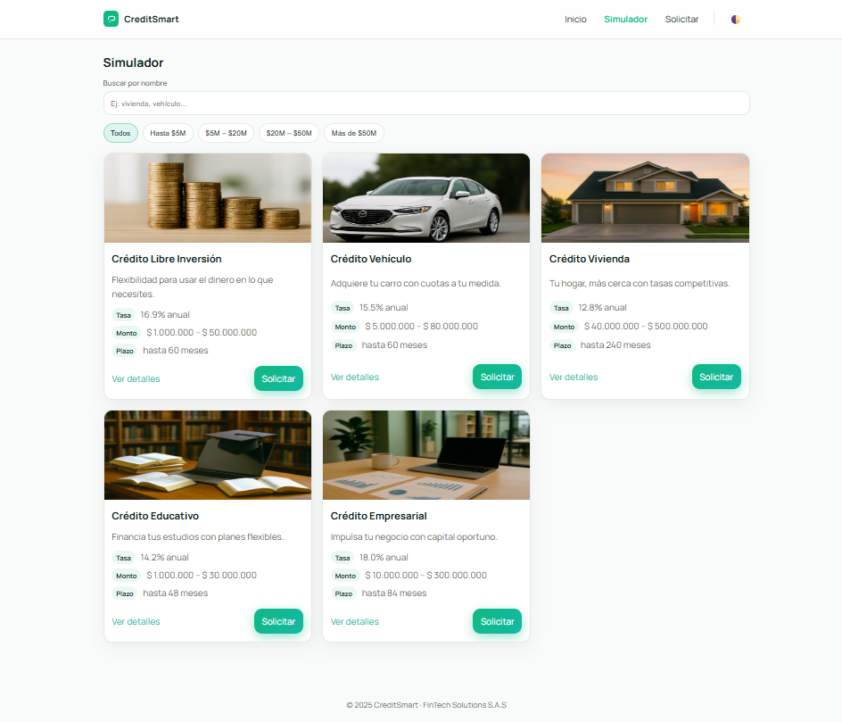
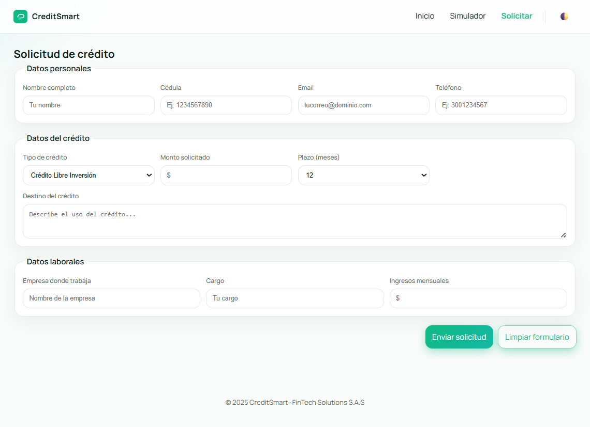

S20 - EA1: Diseño de Interfaces Web - CreditSmart — Ingeniería Web I — 2025.

# 💵 CrediSmart

**CrediSmart** es un sistema web diseñado para facilitar la **consulta, simulación y solicitud de créditos** en línea.  
Este proyecto aplica los principios de **HTML5**, **CSS3** y **diseño responsive** siguiendo buenas prácticas de maquetación y semántica.

---

#Características

- Página principal (`index.html`): catálogo de créditos disponibles.  
- Página de simulador (`simulador.html`): búsqueda y filtrado de créditos por nombre o monto.  
- Página de solicitud (`solicitar.html`): formulario para registrar una solicitud de crédito.  
- Diseño limpio, minimalista y adaptativo (desktop, tablet y móvil).  

---

# Tecnologia utilizadas

- HTML5 (estructura semántica)  
- CSS3 (estilos y diseño responsive)  
- Git / GitHub (control de versiones y despliegue)

---

# Instrucciones para ejecutar el proyecto: 
! (abrir index.html)

# Capturas

# INDEX 

# SIMULADOR

# FORMULARIO SOLICITUD

---

# Autor
Desarrollado por:
 **William García Leonel**  
 **Jose David Osorio Gallego**  

