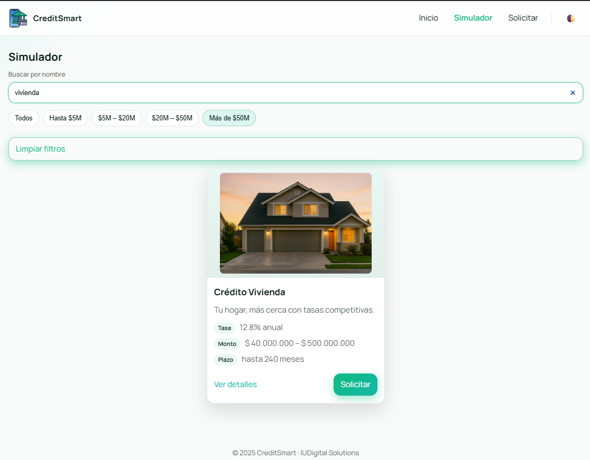
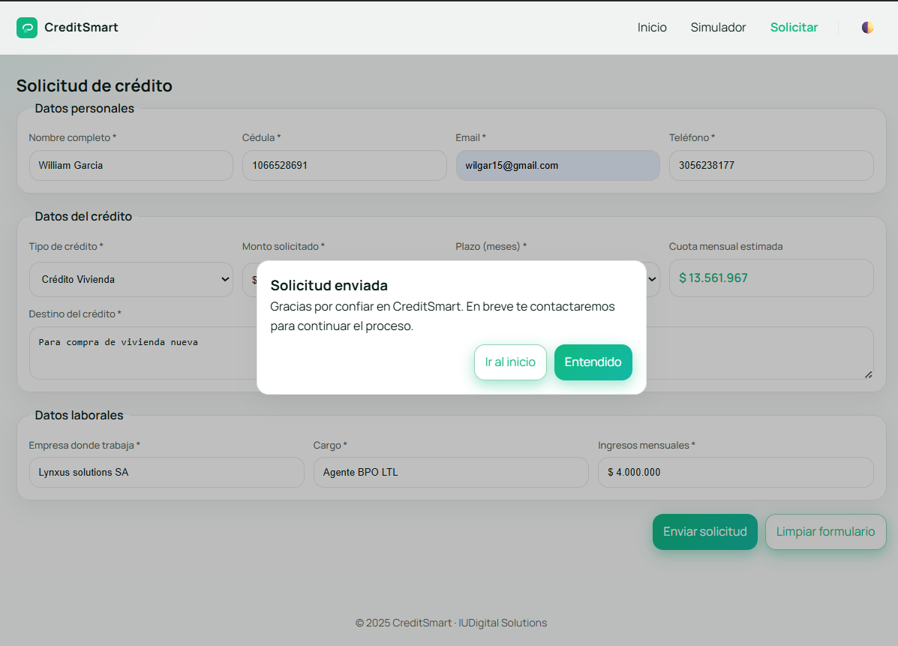

# 🎓 CreditSmart - Aplicación Web Dinámica con React

**Estudiantes:** William Garcia Leonel y José David Osorio Gallego
**Programa:** Desarrollo de Software 
**Curso:** Ingeniería Web I  
**Universidad:** IUDigital De Antioquia
**Fecha:** Noviembre 2025

---

## 📋 Descripción del Proyecto

**CreditSmart** es una aplicación web dinámica desarrollada con **React 18** que transforma un diseño estático HTML/CSS/JS original en una **Single Page Application (SPA)** completamente interactiva. La aplicación permite a los usuarios explorar, comparar, simular y solicitar diferentes tipos de créditos financieros de manera intuitiva y eficiente.

Este proyecto fue desarrollado como parte de la evaluación **EA2: Desarrollo de Aplicación Web Dinámica con React** para la asignatura de **Ingeniería Web I**, demostrando la migración exitosa de tecnologías web tradicionales a React con todas las funcionalidades dinámicas requeridas.

---

## 🚀 Tecnologías Utilizadas

### Frontend
- **React 18** - Librería principal para construcción de interfaces
- **Vite** - Herramienta de construcción rápida (más moderna que Create React App)
- **React Router DOM v6** - Manejo de navegación entre páginas

### Lenguajes y Frameworks
- **JavaScript ES6+** - Con hooks, componentes funcionales y métodos de arrays
- **CSS3** - Estilos modernos con variables CSS y diseño responsive
- **HTML5** - Estructura semántica

### Características Técnicas Implementadas
- ✅ Componentes funcionales con hooks
- ✅ Estado reactivo con `useState`
- ✅ Efectos secundarios con `useEffect`
- ✅ Navegación con React Router
- ✅ Formularios 100% controlados
- ✅ Validaciones en tiempo real
- ✅ Cálculos financieros automáticos
- ✅ Persistencia de tema en localStorage

---

## ✨ Características Principales

### 🏠 Página de Inicio (Home)
- Hero section con llamados a la acción visualmente atractivos
- Catálogo completo de 6 productos crediticios renderizados dinámicamente
- Componente reutilizable CreditCard que muestra información de cada crédito
- Diseño responsive que funciona en móviles, tablets y escritorio
- Transiciones suaves y efectos visuales para mejorar la experiencia

### 🔍 Simulador de Créditos
- Búsqueda en tiempo real por nombre de crédito (case-insensitive)
- 5 filtros dinámicos por rango de monto (Hasta $5M, $5M-$20M, $20M-$50M, Más de $50M, Todos)
- Filtrado combinado que permite usar búsqueda y rango simultáneamente
- Preselección desde URL usando parámetros query (`?producto=`)
- Renderizado dinámico de resultados con mensaje cuando no hay coincidencias
- Botón "Limpiar filtros" para restablecer búsquedas

### 📝 Formulario de Solicitud de Crédito
- 11 campos 100% controlados por React (no por el DOM)
- Validaciones en tiempo real con 3 niveles: `onBlur`, `onChange` (si touched), `onSubmit`
- Formateo automático de campos monetarios (ej: $10.000.000)
- Cálculo automático de cuota mensual usando fórmula de amortización francesa
- Validación contextual donde el monto mínimo/máximo cambia según el tipo de crédito seleccionado
- Sistema de feedback visual que muestra errores solo en campos visitados
- Modal de confirmación al enviar exitosamente
- Función de limpiar formulario que resetea todos los campos

### 🎨 Funcionalidades Adicionales
- Tema claro/oscuro con persistencia en localStorage
- Navegación sticky que se mantiene visible al hacer scroll
- Enlaces activos resaltados según la página actual
- Menú responsive para dispositivos móviles con animación
- Componentes modulares fáciles de mantener y reutilizar

---

## 📁 Estructura del Proyecto

```
creditsmart-react/
│
├── public/                          # Archivos estáticos públicos
│   ├── img/                        # Imágenes de productos y hero
│   │   ├── credit-consumo.png
│   │   ├── credit-educativo.png
│   │   ├── credit-empresarial.png
│   │   ├── credit-libre.png
│   │   ├── credit-vehiculo.png
│   │   └── credit-vivienda.jpg
│   │   └── hero_image.jpg
│   └── logo.png                    # Logo principal
│
├── src/                            # Código fuente principal
│   ├── components/                 # Componentes reutilizables
│   │   ├── Navbar.jsx             # Barra de navegación con tema claro/oscuro
│   │   ├── Footer.jsx             # Pie de página con año dinámico
│   │   └── CreditCard.jsx         # Tarjeta reutilizable para créditos
│   │
│   ├── pages/                      # Páginas/Vistas principales
│   │   ├── Home.jsx               # Página de inicio con catálogo
│   │   ├── Simulator.jsx          # Simulador con filtros y búsqueda
│   │   └── RequestCredit.jsx      # Formulario de solicitud con validaciones
│   │
│   ├── data/                       # Datos y funciones utilitarias
│   │   └── creditsData.js         # Array de créditos + helpers
│   │
│   ├── App.jsx                     # Componente raíz con routing
│   ├── App.css                     # Estilos globales
│   ├── index.css                   # Reset CSS y fuentes
│   └── main.jsx                    # Punto de entrada de React
│
├── package.json                    # Dependencias y scripts
├── vite.config.js                  # Configuración de Vite
├── .gitignore                      # Archivos ignorados por Git
└── README.md                       # Este archivo
```

---

## 🛠️ Configuración y Ejecución

### Prerrequisitos
- Node.js versión 16 o superior
- npm (viene con Node.js) o yarn

### Pasos para Ejecutar

**1. Clonar el repositorio**
```bash
git clone https://github.com/tu-usuario/creditsmart-react.git
cd creditsmart-react
```

**2. Instalar dependencias**
```bash
npm install
```

**3. Ejecutar en modo desarrollo**
```bash
npm run dev
```
La aplicación estará disponible en `http://localhost:5173`

**4. Construir para producción**
```bash
npm run build
```

**5. Previsualizar build de producción**
```bash
npm run preview
```

---

## 🎯 Cumplimiento de la Rúbrica

### 1. Configuración y Estructura de React

**Lo que hicimos:**
- Creamos el proyecto usando **Vite** (recomendado por ser más rápido y moderno)
- Organizamos las carpetas en `components/`, `pages/`, `data/`
- Usamos nombres claros para archivos: PascalCase para componentes
- Implementamos **React Router** con 3 rutas: `/`, `/simulador`, `/solicitar`
- Configuramos `App.jsx` para que tenga Navbar y Footer persistentes en todas las páginas

**Código ejemplo (routing en App.jsx):**
```jsx
<BrowserRouter>
  <Navbar />
  <Routes>
    <Route path="/" element={<Home />} />
    <Route path="/simulador" element={<Simulator />} />
    <Route path="/solicitar" element={<RequestCredit />} />
  </Routes>
  <Footer />
</BrowserRouter>
```

### 2. Componentes y Props

**Lo que hicimos:**
- Creamos componentes funcionales en lugar de clases (más moderno)
- Diseñamos `CreditCard.jsx` como componente reutilizable
- Usamos desestructuración de props para código más limpio y legible
- Mantuvimos la regla de un componente por archivo

**Código ejemplo (desestructuración en CreditCard.jsx):**
```jsx
function CreditCard({ credit }) {
  const { id, name, desc, icon, rate, min, max, termMax } = credit;
  
  return (
    <article className="card">
      
      <h3>{name}</h3>
      <p>{desc}</p>
    </article>
  );
}
```

### 3. Manejo de Estado con useState 

**Lo que hicimos:**
- Usamos `useState` en 10 lugares diferentes
- Pusimos nombres descriptivos a los estados
- Inicializamos los estados apropiadamente
- Actualizamos los estados inmutablemente usando spread operator

**Código ejemplo (estados en RequestCredit.jsx):**
```jsx
const [formData, setFormData] = useState({
  nombre: '', cedula: '', email: '', // ... 8 campos más
});

const [errors, setErrors] = useState({});
const [touched, setTouched] = useState({});
const [monthlyPayment, setMonthlyPayment] = useState(0);
```

### 4. Búsqueda y Filtros Dinámicos 

**Lo que hicimos:**
- Implementamos búsqueda en tiempo real
- Creamos 5 filtros por rango de monto
- Diseñamos lógica de superposición
- Permitimos filtros combinados
- Usamos `useEffect` para filtrado automático

**Código ejemplo (filtrado en Simulator.jsx):**
```jsx
useEffect(() => {
  let results = [...creditsData];
  
  if (searchTerm.trim()) {
    results = results.filter(credit => 
      credit.name.toLowerCase().includes(searchTerm.toLowerCase())
    );
  }
  
  if (activeRange !== 'all') {
    const [min, max] = activeRange.split('-').map(Number);
    results = results.filter(credit => {
      return (credit.min >= min && credit.min <= max) || 
             (credit.max >= min && credit.max <= max) ||
             (credit.min <= min && credit.max >= max);
    });
  }
  
  setFilteredCredits(results);
}, [searchTerm, activeRange]);
```

### 5. Formulario Controlado 

**Lo que hicimos:**
- 100% controlado por React
- Implementamos validaciones en tiempo real
- Creamos sistema de `touched`
- Prevenimos envío y validamos campos
- Formateamos campos monetarios automáticamente

**Código ejemplo (input controlado):**
```jsx
<input
  type="email"
  name="email"
  value={formData.email}
  onChange={handleChange}
  onBlur={handleBlur}
  required
/>
{touched.email && errors.email && (
  <span className="error">{errors.email}</span>
)}
```

### 6. Manipulación de Arrays 

**Lo que hicimos:**
- Usamos `.map()` 5 veces para listas dinámicas
- Usamos `.filter()` 3 veces para filtrados
- Usamos `.find()` 2 veces para búsquedas
- Usamos `.split().map(Number)` para convertir rangos
- Siempre usamos key único en listas

**Código ejemplo:**
```jsx
{creditsData.map((credit) => (
  <CreditCard key={credit.id} credit={credit} />
))}

{filteredCredits.map((credit) => (
  <CreditCard key={credit.id} credit={credit} />
))}
```

### 7. Cálculo de Cuota Mensual 

**Lo que hicimos:**
- Implementamos fórmula de amortización 
- Convertimos tasa anual a mensual
- Actualizamos automáticamente la cuota
- Formateamos a COP
- Validamos entradas

**Código ejemplo (función de cálculo):**
```javascript
export const calculateMonthlyPayment = (amount, annualRate, months) => {
  if (!amount || !months || amount <= 0 || months <= 0) return 0;
  
  const monthlyRate = annualRate / 12;
  
  const payment = amount * (monthlyRate * Math.pow(1 + monthlyRate, months)) / 
                  (Math.pow(1 + monthlyRate, months) - 1);
  
  return Math.round(payment);
};
```

---

## 📊 Funcionamiento del Cálculo de Cuota

### Ejemplo Práctico

**Crédito Vehículo:**
- Monto: $10.000.000
- Tasa anual: 15.5%
- Plazo: 36 meses

**Resultado: Cuota = $348.237**

### Tabla de Ejemplos

| Crédito | Monto | Tasa | Plazo | Cuota |
|---------|-------|------|-------|-------|
| Vivienda | $100M | 12.8% | 120 meses | $1.164.825 |
| Educativo | $5M | 14.2% | 24 meses | $239.088 |
| Vehículo | $10M | 15.5% | 36 meses | $348.237 |
| Libre | $3M | 16.9% | 12 meses | $273.384 |
| Empresarial | $50M | 18.0% | 60 meses | $1.267.427 |
| Consumo | $2M | 22.4% | 12 meses | $186.733 |

---

## 🔧 Conceptos Técnicos Aprendidos

### Hooks de React Utilizados
- **useState** - Manejo de estado local (10 usos)
- **useEffect** - Efectos secundarios y sincronización
- **useLocation** - Detección de ruta activa
- **useSearchParams** - Lectura de parámetros de URL
- **useNavigate** - Navegación programática

### Patrones de React Implementados
- Componentes funcionales
- Composición sobre herencia
- Props unidireccionales
- Lifting state up
- Controlled components

### Buenas Prácticas Implementadas
- Key única en listas
- Inmutabilidad
- Separación de responsabilidades
- Nombres descriptivos
- Documentación con JSDoc

---

## 🚀 Desafíos y Soluciones

### Desafío 1: Filtrado por Rangos Superpuestos
- **Problema:** Rangos que se sobrelapan
- **Solución:** Lógica de superposición con 3 condiciones

### Desafío 2: Validación Progresiva
- **Problema:** Mostrar errores prematuramente
- **Solución:** Estado `touched` que marca campos visitados

### Desafío 3: Formateo Monetario en Tiempo Real
- **Problema:** Formato durante escritura
- **Solución:** `Intl.NumberFormat` en handleChange

### Desafío 4: Cálculo Automático de Cuota
- **Problema:** Múltiples dependencias
- **Solución:** `useEffect` con 3 dependencias

---

## 📱 Responsive Design

La aplicación está optimizada para:
- **Móviles** (375px+) - Menú hamburguesa, columnas simples
- **Tablets** (768px+) - 2 columnas en grid
- **Escritorio** (1024px+) - 3 columnas en grid

---

## 🎨 Temas y Personalización

- Tema claro/oscuro intercambiable
- Persistencia en localStorage
- Variables CSS para colores
- Animaciones suaves

---

## 📈 Métricas del Proyecto

- **Líneas de código:** ~1,050 líneas funcionales
- **Componentes:** 3 reutilizables + 3 páginas
- **Commits:** 15+ commits descriptivos
- **Estados:** 10 estados diferentes
- **Operaciones:** 13 usos de `.map()`, `.filter()`, `.find()`
- **Validaciones:** 9 tipos diferentes
- **Campos del formulario:** 11 campos controlados

---

## 🔗 Integración con Git

### Cambios que Realizamos 
```
✅ Configuración inicial con Vite y React Router
✅ Creación de estructura de carpetas
✅ Implementación de Navbar con tema
✅ Componente CreditCard reutilizable
✅ Página Home con catálogo
✅ Página Simulator con búsqueda
✅ Filtros dinámicos por rango
✅ Página RequestCredit con formulario
✅ Validaciones en tiempo real
✅ Cálculo de cuota mensual
✅ Sistema de touched
✅ Persistencia de tema
✅ Responsive design
✅ Documentación README
✅ Optimizaciones finales
```

---

## 📚 Recursos y Referencias

- [Documentación oficial de React](https://react.dev)
- [React Router v6](https://reactrouter.com)
- [Vite Documentation](https://vitejs.dev)
- [MDN Web Docs (JavaScript)](https://developer.mozilla.org/es/docs/Web/JavaScript)

---

## 👥 Trabajo en Equipo

Este proyecto fue desarrollado colaborativamente:
- Diseño conjunto de arquitectura
- División de tareas según especialización
- Revisión mutua de código
- Documentación compartida
- Pruebas en diferentes dispositivos

---

## 🎓 Aprendizajes Obtenidos

### Técnicos
- Migración de HTML/CSS/JS a React
- Manejo profesional de estado con hooks
- Implementación de routing
- Validación avanzada de formularios
- Manipulación de arrays funcional
- Cálculos matemáticos integrados

### Colaborativos
- Control de versiones con Git
- Documentación técnica
- Resolución de problemas
- Presentación de proyectos

---

## 📚 Capturas del Proyecto

# INDEX 


# SIMULADOR



# FORMULARIO SOLICITUD





---

## 🔗 Enlaces del Proyecto

**Repositorio GitHub:** [https://github.com/Wilgarle/Credi_Smart.git](https://github.com/Wilgarle/Credi_Smart.git)

**Demo en vivo:** Ejecutar `npm run dev` y abrir http://localhost:5173


